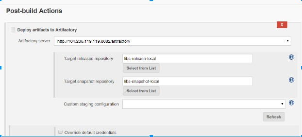

#  Assignment of Development of Large Systems  (DRAFT)
## by group What?
  
This is created for the assignment of the course "Development of Large Systems" at CPHbusiness.  

Cluster I has agreed on a contract and we implemented against the contract.  

[The link to code contract and toolbox](https://github.com/Legendslayer/FerryProjectContract)  

  
We have created the backend mock projects and frontend project.  
As the digram below shows, the backend mock has a dependency of the contract project and the frontend has a dependency of the dummy backend project.  


The links to the projects are following;  

[Frontend project](https://github.com/tompet815/frontend_customer)  
[Backend mock project](https://github.com/Madalina1994/BackendMockFerry)  


## Setup overview
  
This is the jenkins url: [http://46.101.194.147:8080/](http://46.101.194.147:8080/) .
Here we build the projects in order to use them as dependencies.  

This is the artifactory url: [http://104.236.119.119:8082/artifactory/](http://104.236.119.119:8082/artifactory/webapp/home.html?5).  
Here we store the jar files built by Jenkins. The pom file references the versions of the dependency from the artifactory.


The diagram above shows our deployment scenario. We push our code to Github, and build on Jenkins server.  
After successful build, we deploy jar/war files on Artifactory.  
The next build step is to build a docker image and register it to Docker hub, and as last step,  
the image will be deployed to a docker container.


## Jenkins Setup 
  
Jenkins is set up so that every time a change is pushed to GitHub, a build job is generated.


  
We set up the build trigger so that the build of BackendMock will trigger the build of Frontend_Customer.
In order for that to be possible, we not only set up jenkins, but also to add a webhook on GitHub. An example is shown below:
  

  
Jenkins is also set up so that when a build job is finished, the jar file will be saved to the artifactory.  
The set up is shown in the following picture  



A view of the list of builds in the artifactory can be seen below:  
  

  
## Testing  

We implemented tests for the dummy backend and frontend.  
Backend group promised to create contract test, but we don’t have any test at this point (28th dec 2016) yet.  
So we created a sample contract test to see how it works.  

[Link to Contract Test](https://github.com/tompet815/ContractTest_JustForTrial)

We cannot run the contract test by itself.  
We should tell contract test which class it should test against. In our case, DummyCustomerBackend. 
We start the contract test from CustomerContract test in DummyBackendTest. 

```java
public class CustomerContractTest {    
    
    @BeforeClass
    public static void setUpClass() {
        CustomerInterfaceHolder.customerInterface =new DummyCustomerBackend();
         }   
   
}
```
The diagram below shows our verification structure.


## Code examples
  
We will show some code examples of implementation of the use case "Cancel reservation" below.

*  From the web servlet:

```java
reservationNo = request.getParameter("reservationno");
            if (reservationNo == null) {
                request.setAttribute("hidden", "hidden");
                request.setAttribute("error", "Error. The reservation number is required");
            }
            else {

                int intResNo = Integer.parseInt(reservationNo);
                if (mock.deleteReservation(new ReservationIdentifier(intResNo))) {
                    request.setAttribute("hidden", "hidden");
                    request.setAttribute("success", "Your reservation has successfully deleted.");
                }
                else {
                    request.setAttribute("hidden", "");
                    request.setAttribute("error", "System Error. Please contact Cluster II Ferries");
                }
            }
```
  
* From the jsp file:
```html
<form method="post" style="display:inline-block">
     <input name="reservationno" hidden value="${reservationno}">
     <button type="submit"class="btn btn-danger">Delete reservation <i class="fa fa-ban" aria-hidden="true"></i></button>
</form>
```
